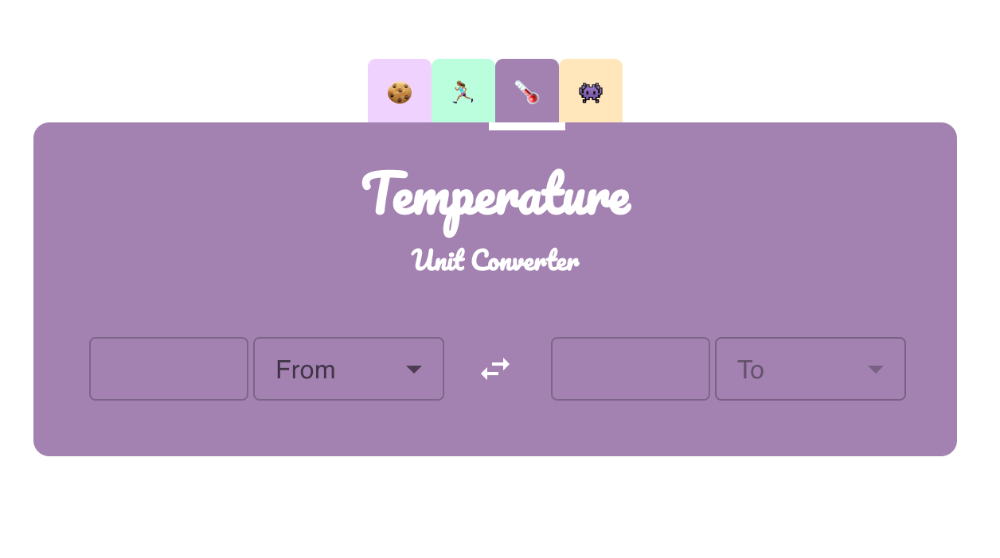
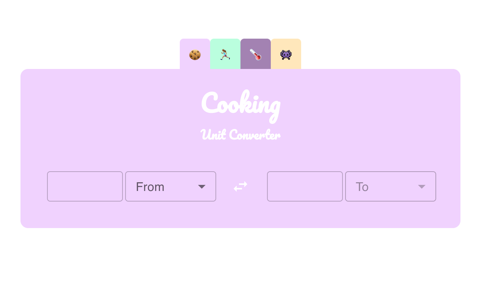

  <h1> UNIT CONVERTER APP </h1>

[🔗 Unit Converter](https://theunitconverter.netlify.app/)

A webapp made with REACT and TYPESCRIPT to convert different kind of units

  

## STRUCTURE

This app has a main view that includes 4 components:

- A TabGroup : this component renders a tab and a tab panel for each type of conversion and group them all
- An InputField: used for submiting the number to convert and to display the converted data
- A SelectInput: that shows all the disponibles units for a conversion type
- Footer

The value of each unit to make the conversions is stored in the [unit.tsx](src/units/unit.tsx) file, where an array of objects includes all the types of conversion an the units for each one, with the unit name and the unit value.

The [converter.tsx](src/converter.tsx) file includes three helper functions that are used inside the TabGroup component to get the result for the conversion.

The values for each unit to make the conversions are stored in the [unit.tsx](src/units/unit.tsx) file, where an array of objects includes all the types of conversion an the units for each one.

## Installation

npm i

npm start

## Stack

This app was made with **Typescript**, **React** and **MUI**
Also includes the [React Tabs](https://www.npmjs.com/package/react-tabs) component.
The styles are writen in **SASS**
